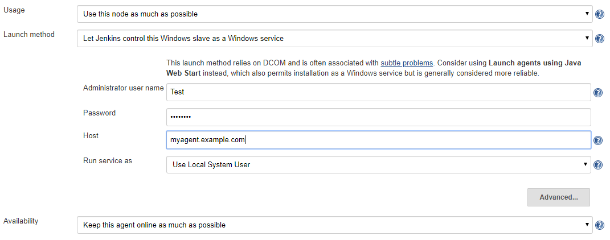

= WMI Windows Agents Plugin for Jenkins 

Allows you to setup agents on Windows machines over Windows Management Instrumentation (WMI).

== Usage

Once the plugin is installed, a new launch type is available in the agent configuration.
Once the agent configuration is saved,
Jenkins will reconnect the agent using the plugin.

== How does it work?

This section goes into the details of how the managed Windows agent launcher actually works.

This launcher uses several protocols that has been around for a quite some time.

* It first uses http://en.wikipedia.org/wiki/Server_Message_Block[CIFS] (also known as "Windows file share protocol") to push files into the
agent. 
When used by someone with administrative privileges, Windows file shares expose what's commonly known as "administrative shares",
which are hidden exported directories that cover every drive in the system.
* It then uses
http://en.wikipedia.org/wiki/Distributed_Component_Object_Model[DCOM] to
talk to
http://en.wikipedia.org/wiki/Windows_Management_Instrumentation[WMI] to
install and start a service remotely.
* Jenkins uses two services, one is called
https://github.com/jenkinsci/lib-windows-remote-command[Remote Communication Service] and this provides a general-purpose remote command execution capability. 
Jenkins uses this to check if Java is available and if not install it. 
A failure to do this is not fatal problem, as Jenkins will proceed by assuming that Java is available in a reasonable place.
This service is destroyed after it is used so as not to cause any harm to the security. 
The communication between Jenkins master and this service happens over a named pipe, which itself is protected by access control.
* Jenkins then installs the actual agent as a Windows service, by using the WMI over DCOM, then it starts this service.

== Troubleshooting

See link:docs/troubleshooting.adoc[Troubleshooting WMI Windows Agents].

=== Useful links

* https://wiki.jenkins.io/display/JENKINS/Installing+Jenkins+as+a+Windows+service[Installing Jenkins as a Windows service]
